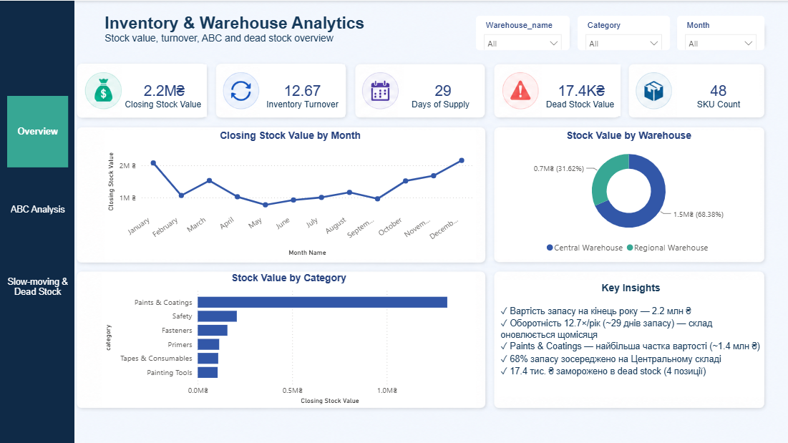
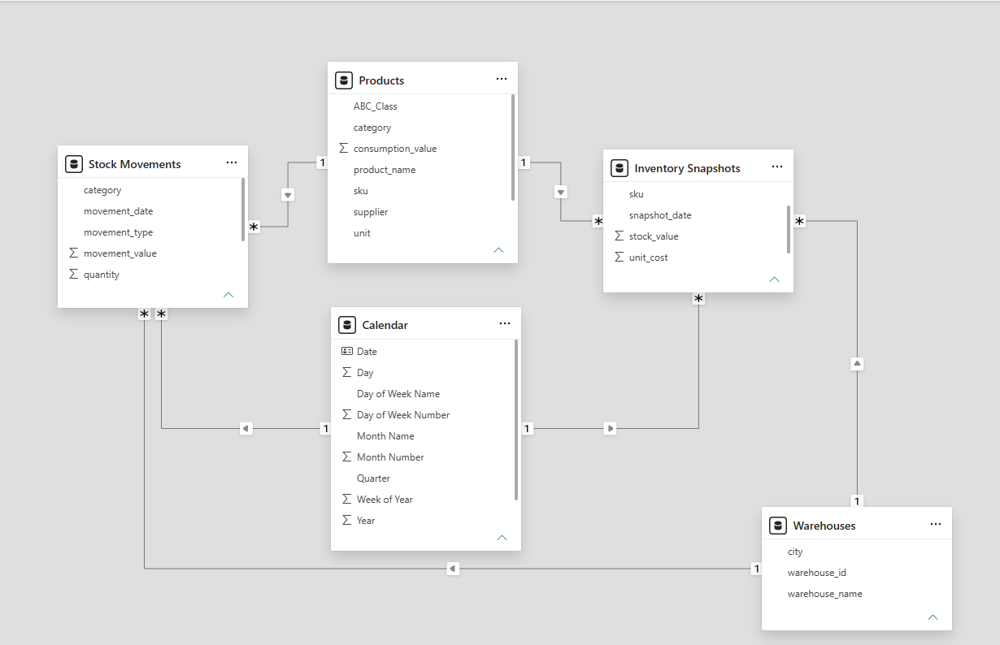
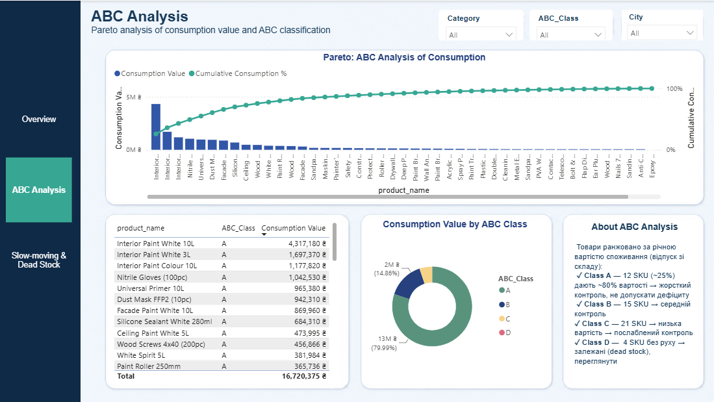
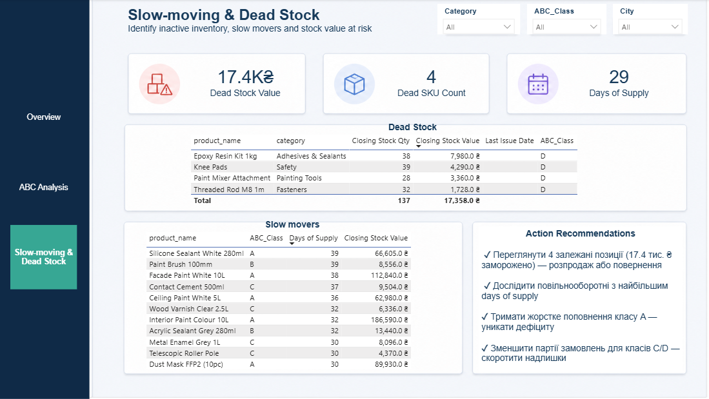

# Аналітика складських запасів — залишки, оборотність та ABC

**🌐 Мова:** [English](README.md) · **Українська**


Наскрізний проєкт у **Power BI** з аналізу складських запасів **виробника й дистриб'ютора лакофарбової продукції**: вартість запасів, оборотність, повільнооборотні та залежані позиції і **ABC-аналіз** товарів. Я зробила його, щоб відповісти на головне питання будь-якого менеджера з запасів — **де «заморожені» гроші на складі та які позиції потребують жорсткого контролю?**

> **Обсяг:** у межах ТМЦ проєкт зосереджено на групі **«товари»** (придбані для перепродажу). Той самий підхід масштабується на інші групи запасів — сировину, готову продукцію та запчастини.
>
> 🔗 **Виробнича** сторона тієї ж компанії (собівартість виробництва) аналізується в окремому проєкті — [**Manufacturing Cost Analytics**](https://github.com/innaanalysts/manufacturing-cost-analytics).



---

## 🎯 На які бізнес-питання відповідає проєкт

- Яка загальна **вартість запасів** і як вона змінюється від місяця до місяця?
- Наскільки швидко обертаються запаси (**inventory turnover**, **days of supply**)?
- Які позиції — **повільнооборотні** чи **залежані (dead stock)**, де гроші стоять без руху?
- Як розподілена вартість запасів за **ABC-класами** (де сконцентрована вартість)?
- Як запаси розподілені по **складах** і **категоріях**?

---

## 📊 Ключові результати (2024)

| Показник | Значення |
|---|---|
| Річна вартість споживання | **≈ 16.7 млн ₴** |
| Вартість запасу на кінець року | **≈ 2.2 млн ₴** |
| Оборотність запасів | **12.7× / рік** |
| Days of supply | **≈ 29 днів** |
| Залежані запаси | **17.4 тис. ₴ у 4 SKU** |
| **Розподіл ABC** | **A: 12 · B: 15 · C: 21 · D (dead): 4** |

ABC-аналіз підтверджує класичний Парето: **~25% SKU дають ~80% вартості споживання**. Чотири позиції **не рухалися цілий рік** — товар лежить на складі, а гроші заморожені — тож я винесла їх в окремий клас **D (dead stock)**.

---

## 🛠️ Технології

- **Power BI** — модель даних (зіркова схема), DAX-міри, інтерактивний звіт на 3 сторінки
- **Power Query (M)** — очищення даних, обʼєднання (merge) і весь конвеєр **ABC-класифікації**
- **Excel / CSV** — джерело даних

---

## 🗂️ Модель даних

**Зіркова схема** з двома таблицями фактів (`Stock Movements`, `Inventory Snapshots`), що ділять три довідники (`Products`, `Warehouses`, `Calendar`).



| Таблиця | Роль | Опис |
|---|---|---|
| `Products` | Довідник | 48 товарів із категорією, ціною, постачальником + **ABC-клас** |
| `Warehouses` | Довідник | 2 склади (Київ, Львів) |
| `Calendar` | Довідник | таблиця дат 2024 (місяць, квартал, рік) |
| `Stock Movements` | Факт | транзакції надходжень і відпуску |
| `Inventory Snapshots` | Факт | залишки на кінець місяця по товару/складу |

---

## 🔧 Родзинки Power Query

Трансформація даних — це кістяк проєкту:

- **Merge** `unit_cost` / `category` з `Products` у таблиці фактів і обчислення вартісних стовпців (`movement_value`, `stock_value`).
- **ABC-класифікація повністю в Power Query**: фільтр відпуску → групування за SKU → сортування за вартістю → наростаючий підсумок → накопичений % → умовний клас (A ≤ 80%, B ≤ 95%, C — решта).
- Розірвано **циклічне посилання** через незалежний запит-довідник цін — реальна проблема моделювання, вирішена чисто.
- Виявлено **dead stock**: позиції без руху випадають з ABC — я позначила їх класом **D**, перетворивши `null` на бізнес-сигнал.

## 🧮 Ключові DAX-міри

`Total Issues Value` · `Closing Stock Value` · `Avg Stock Value` · **`Inventory Turnover`** · **`Days of Supply`** · **`Dead Stock Value`** · `Cumulative Consumption %` (для кривої Парето).

---

## 📈 Сторінки звіту

**1. Overview** — KPI, тренд вартості запасу, розподіл по складах і категоріях, ключові інсайти.


**2. ABC Analysis** — діаграма Парето (стовпці + накопичений %), вартість за класами, топ-товари.


**3. Slow-moving & Dead Stock** — таблиця залежаних (без руху), повільнооборотні за days of supply, рекомендації до дій.


---

## 📁 Структура репозиторію

```
├── data/
│   ├── products.csv
│   ├── warehouses.csv
│   ├── stock_movements.csv
│   └── inventory_snapshots.csv
├── inventory_warehouse.pbix          # Звіт Power BI (модель + 3 сторінки)
├── inventory_warehouse_dashboard1.png
├── inventory_warehouse_dashboard2.png
├── inventory_warehouse_dashboard3.png
└── inventory_warhouse_data_model.png
```

---

> **Про дані:** цифри згенеровано синтетично для демонстрації, вони не належать жодній реальній компанії. Проте асортимент, сезонність і поведінка запасів змодельовані на основі того, як насправді працює склад будматеріалів.

---

## 📬 Контакти

**Інна Ткаченко**

[](https://www.linkedin.com/in/inna-tkachenko-3aba54b5/)
[](https://github.com/innaanalysts)

Якщо проєкт зацікавив або маєте зауваження — пишіть, я завжди відкрита до спілкування.
